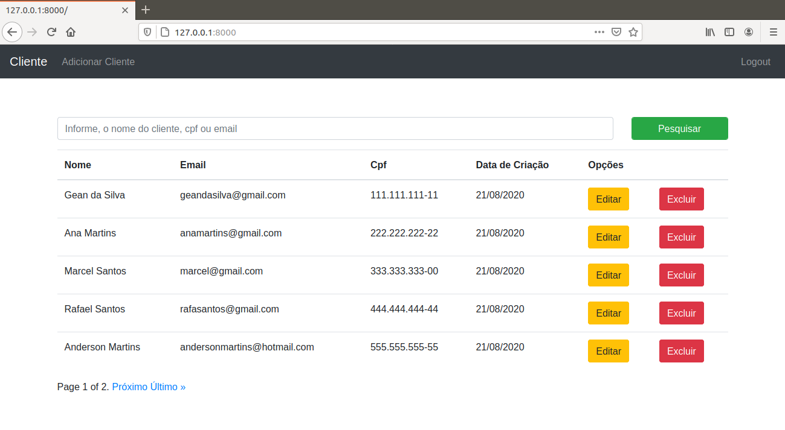

# Crud Django

Este projeto apresenta Crud de Clientes Django.

Outros pontos do projeto:

* Uso de paginação
* Uso de Busca





## Rodando o Projeto

* Clone o repositório

```
git clone https://github.com/CleitonSilvaT/CrudDjango.git
```


* Crie uma vitualenv dentro do projeto utilizando Python 3

```
cd CrudDjango
python3 -m venv .venv
```


* Ative o virtualenv

```
source .venv/bin/activate
```


* Atualize o pip

```
pip install --upgrade pip
```


* Instale as dependências

```
pip install -r requirements.txt
```


* Rode as migrações

```
python manage.py migrate
```

* Rode o servidor django

```
python manage.py runserver
```


## Configuração do Projeto

Este projeto contém duas branches principais

* master

Contém o projeto integrado ao Heroku


* local

Contém o projeto para uso local


## Principais Tecnologias

Este projeto foi construído utilizando:

* Python 3.8.5
* Django 3.1
* Bootstrap 4
* JQuery 3.5.1
* Popper
